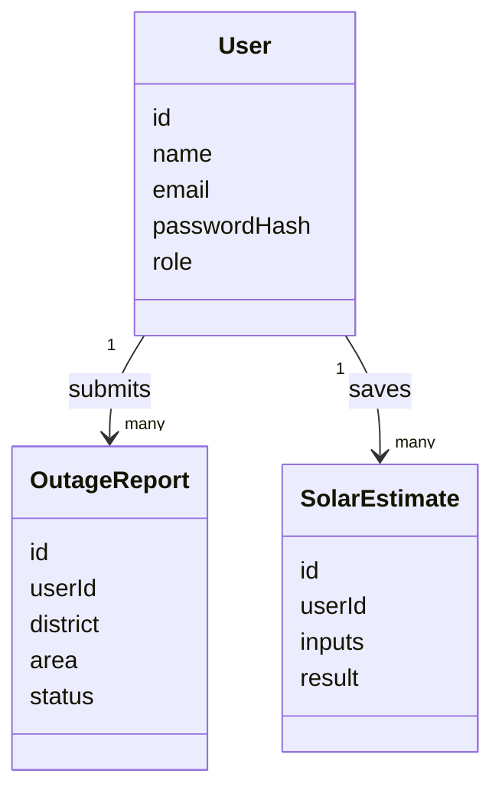

# Data Model

The Stage 1 implementation uses a JSON file for portability:

```text
backend/data/powerpulse.db.json
```

This maps cleanly to relational tables for a later PostgreSQL/Prisma version.

## Users

```text
id
name
email
passwordHash
role
createdAt
```

Roles:

```text
user
admin
```

## Outage Reports

```text
id
userId
district
area
outageType
startedAt
durationHours
severity
note
status
createdAt
reviewedAt
reviewedBy
```

Types:

```text
loadshedding
maintenance
power_on
```

Statuses:

```text
pending
verified
resolved
dismissed
```

## Solar Estimates

```text
id
userId
createdAt
inputs
result
```

The `inputs` object stores battery, panel, sunlight, and appliance counts. The `result` object stores calculated load, usable battery energy, estimated backup time, solar recharge, status, load breakdown, and advice.

## Relationship Diagram



## Prisma Migration Sketch

```prisma
model User {
  id             String          @id @default(cuid())
  name           String
  email          String          @unique
  passwordHash   String
  role           String          @default("user")
  createdAt      DateTime        @default(now())
  outages        OutageReport[]
  solarEstimates SolarEstimate[]
}

model OutageReport {
  id            String   @id @default(cuid())
  userId        String
  district      String
  area          String
  outageType    String
  startedAt     DateTime
  durationHours Float
  severity      String
  note          String
  status        String   @default("pending")
  createdAt     DateTime @default(now())
  user          User     @relation(fields: [userId], references: [id])
}

model SolarEstimate {
  id        String   @id @default(cuid())
  userId    String
  inputs    Json
  result    Json
  createdAt DateTime @default(now())
  user      User     @relation(fields: [userId], references: [id])
}
```
