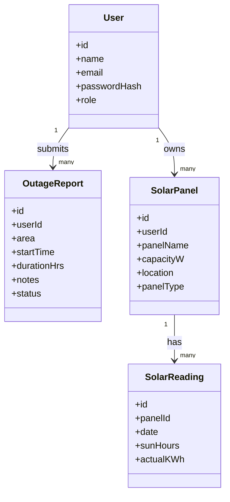

# Loadshedding Intelligence Platform with Solar Support – Research & Plan

## Executive Summary  
Bangladesh’s power sector still suffers frequent outages outside major cities, despite recent improvements.  Rural and peri-urban areas often face multi-hour loadshedding, disrupting homes, schools, hospitals, and small businesses【3†L222-L230】【3†L247-L256】.  Unreliable supply costs Bangladesh roughly **2% of GDP**【47†L3068-L3076】, through lost productivity and diesel use.  Meanwhile, solar home systems (SHS) have proliferated: an estimated **5.5 million SHS** now serve ~4 million rural households (20 million people) off-grid【32†L90-L99】【17†L1500-L1508】.  Yet maintenance issues (batteries, inverters) persist, and rooftop solar in cities remains modest (~300–400 MW by 2026)【32†L90-L99】【22†L139-L148】.  

A **Loadshedding Intelligence Platform with Solar Module** can fill critical gaps: by crowd-sourcing outage reports, mapping affected areas, and offering insights on home solar backup.  Our web app will allow users to report outages and view a dashboard of local status, while a solar monitor component lets households log their panel capacity, sunlight, and output to calculate efficiency and backup reliability during outages.  This solution tackles a real Bangladesh need (corroborated by press reports and World Bank/IEA data) and ties directly to course objectives in frontend, backend, database, security, and deployment.

## 1. Evidence on Power Outages & Solar (verified)  
- **Loadshedding persists** in many districts.  Government sources recently boasted “no loadshedding for a week” (late Apr–early May 2026) as supply briefly met demand【2†L58-L66】, but independent reports tell another story.  In April 2026, *The Daily Star* documented **worsening cuts in Sylhet, Noakhali, and Gazipur**, with only 60–66% of demand met in rural Sylhet (a 215MW deficit) and factories in Gazipur shut 10–12 hrs/day【3†L222-L230】【3†L258-L263】.  Hospitals ran on costly diesel, students lost study hours, and shopkeepers were forced to close early【3†L222-L230】【3†L250-L259】.  Bangladesh’s reliance on imported fuel (LNG, coal) leaves it vulnerable to supply delays; recent fuel shortages caused spikes in shedding (e.g. Sept 2025 saw ~400MW peak deficits【5†L116-L124】).  

- **Electrification level** is high but not universal.  According to the IEA, about **85% of Bangladeshis have electricity access**【39†L229-L237】, up from 20% in 2000, largely via grid expansion.  However, distribution gaps remain: urban areas are prioritized, while villages (“haors” and islands) still experience localized cuts.  Seasonal rains can sharply change demand, and limited gas supply means some efficient plants idle【5†L116-L124】【47†L3068-L3076】.  Official forecasts (BPDB/PGCB) closely match demand, but unplanned outages (maintenance, line faults) still occur, and a complete real-time outage map is absent.

- **Social/Economic impact**:  Unpredictable power harms livelihoods.  A World Bank report notes that voltage drops/outages cost ~**2% of GDP**【47†L3068-L3076】.  Factories lose shifts (Gazipur had 2,836 shutdowns【3†L258-L263】), schools face disrupted study, and hospital diesel expenses rise into lakhs of takas per month【3†L247-L256】.  Vulnerable groups include low-income families (who cannot afford generators), small businesses (tailors, shops), and rural users.  Notably, power cuts appear disproportionate: *“supply is first reduced in rural areas, only if deficit worsens do urban areas see cuts”*【4†L0-L4】 (Prothom Alo).  This urban-rural gap is a key driver for our crowdsourced approach.  

- **Reporting gaps and existing solutions**:  There is no single official platform for crowdsourced outage info.  Distribution utilities offer limited tools (e.g. DPDC’s “Power Interruption Tracking” requires customer ID【13†L9-L18】).  The government issues broad advisories, but real-time local data relies on word-of-mouth or news reports.  Recently, private developers launched apps like *“Bijli Pulse”*, which provides a community-powered outage map, one-tap status reports, and even predictive charts【12†L108-L117】【12†L195-L203】.  This shows demand: ordinary users and entrepreneurs see the need for a dedicated interface.  Our website will similarly leverage community input (reporting outages) and complement it with static solar-info pages.

## 2. Problem Analysis (Loadshedding Context)  
- **Frequency & Duration**:  Outages can be routine or emergency.  Media accounts from Apr 2026 describe **daily cuts of 5–12 hours** in some upazilas【3†L247-L256】【3†L258-L263】.  These usually occur during peak evening demand.  If fuel is scarce, shedding may span multiple days, while rainy seasons often see no shedding as demand falls【2†L58-L66】【5†L116-L124】.  Seasonal peaks (e.g. hot summer months, or festive periods) drive spikes.  

- **Geography**:  Affected areas include *rural/Semi-urban regions* fed by Palli Bidyut Samitis (Rural Electrification).  Sylhet Division, Noakhali, and Gazipur (a mix of urban and industrial) were cited in 2026 reports【3†L222-L230】【3†L247-L256】.  In general, peripheral areas (north-east and south) often see more outages.  By contrast, Dhaka, Chattogram, and major urban centers receive priority supply and experience minimal scheduled shedding.  Bangladesh’s grid is geographically extended but some areas still lack high-voltage connections.  

- **Causes**:  The main causes are fuel supply disruptions (e.g. LNG shortage), plant maintenance, and grid faults.  For example, in Sept 2025 coal and LNG shortages forced over 400MW of shedding【5†L116-L124】.  Some local outages are blamed on tree-fall, line maintenance, or accidents【2†L109-L117】, not counted as “planned shedding” by authorities.  Transmission bottlenecks occasionally cause local deficits.  Long-term, reliance on imports (fuel, electricity) makes supply delicate【5†L116-L124】【5†L133-L142】.  

- **Impact on society**:  Frequent cuts disrupt daily life.  Small businesses (shops, tailors) may close early due to unreliable power【3†L222-L230】.  Healthcare uses expensive diesel (Tk4–5 lakh/day for hospitals in Sylhet)【3†L250-L256】.  Education suffers when students and teachers lack lighting.  Pumps and mills in agriculture stall without power.  These effects hit poorer or rural citizens hardest (who often can’t buy backup generators).  Even in cities, surge in outages raises energy costs via longer hours on generators or UPS.  

- **Vulnerable groups**:  Off-grid rural communities lack any formal scheduling and rely on local microgrids.  They often adopted SHS but may still use grid bulbs or extractive connections.  Peri-urban users (e.g. town residents, small factories) face cuts that can shut their operations.  Hospitals and telecom networks are vulnerable: news reported mobile networks warning of disruption during blackouts【38†L5-L9】.  Awareness is uneven: vulnerable groups (illiterate or older people) may not get news of restoration.  

- **Reporting gaps**:  Currently, information flow is patchy.  Many users learn of outages only when power fails, not before.  Government sites post schedules or “no loadshedding” press releases after the fact【2†L58-L66】.  Local news and social media are fragmented.  We found no national open database of outages.  By contrast, a successful community app (Bijli Pulse) shows the utility of crowd-sourcing.  **Unmet need**: A simple website/app where any user (without special credentials) can see area outage status and log their own reports.  Integration with a solar backup calculator is novel (no existing service does that).  This will empower citizens and integrate renewable context.

## 3. Solar Energy Context  
- **Adoption rate**:  Bangladesh leads globally in off-grid solar.  As of 2019, **~5.5 million** SHS units had been installed【32†L90-L99】, making it the largest such program in the world.  These serve ~4 million rural households (about 20 million people) off-grid【32†L90-L99】.  Growth peaked around 2014 (3M by 2014【48†L0-L3】) and continued until rural electrification expanded.  In urban areas, rooftop solar is emerging: by mid-2025, about **370 MWp** was estimated (mostly on commercial/industrial rooftops)【22†L139-L148】, and a recent Renewable Energy Policy targets 3,000 MW by 2025.  However, residential rooftop uptake is still modest (perhaps ~100–200 MW).  In summary: **solar is widespread off-grid, nascent on-grid**.

- **Typical system sizes**:  Most rural SHS installations are small (20–100W panels) with lead-acid batteries (~40–100Ah).  For example, basic systems use a 50W panel with a 12V, 40Ah battery, powering 4–5 LED lights and a radio【17†L1500-L1508】【25†L198-L203】.  Larger homes may have 100–150W panels.  Urban rooftop systems vary: an average medium home might install 1–2 kW, while shops/industries use 5–10 kW or more.  Inverters range from 300W (for small SHS “IPS” units) to 5–10 kW (for home backup).  

- **Common failures and maintenance**:  SHS reliability depends on battery health and panel upkeep.  Lead-acid batteries need periodic watering and replacement (~3–5 years)【27†L807-L814】.  Dust/debris on panels (especially in winter dust season) can reduce output.  Charge controllers and cheap DC-to-AC inverters (IPS) often fail if overloaded.  Lack of user training means some systems are improperly wired or never maintained.  Many users undervalue maintenance: one NGO found almost half of SHS batteries in rural areas were non-operational by age 5.  Our site can include simple instructions or tips (syllabus content: abstraction, functions).

- **Batteries and inverters**:  Today, >95% of SHS batteries are lead-acid, mostly tubular or flat plate.  Per [BDStall], small (~30–55Ah) lead-acid solar batteries cost roughly Tk6,000–9,000; larger (130–200Ah) start around Tk19,000【27†L807-L814】.  A tiny 12V/4.25Ah “toy” battery is ~Tk1,200, but insufficient for lighting.  Li-ion systems exist but remain <5% market due to cost.  Inverters (IPS) widely used are modified sine-wave units costing Tk5,000–30,000 depending on size.  Pure-sine inverters cost more (Tk15k+ for 500W).  Many rural users cannot afford large investments; IDCOL’s microloan covers part of cost.  Financing options include subsidized loans via IDCOL partner organizations, and some banks give green loans at low interest.  

- **Costs and financing**:  A basic 50W SHS with battery and installation might cost ~Tk12,000–15,000 (after subsidies) as a one-time purchase (often financed via 3–5 year loan).  Urban rooftop (grid-tied) is pricier: a 1 kW system (panels, inverter, structure) could be Tk100,000–150,000 installed.  Government incentives (duty exemptions, tax breaks on equipment) help.  Micro-credit was essential for SHS rollout: about 70% of SHS users took loans from IDCOL-backed finance【32†L90-L99】.  Our solar module will assume users have such systems; it will not handle financing, but may note when systems are cost-effective backup.

## 4. User Personas & Scenarios  
To ground requirements, we define typical user profiles:

- **Urban Homeowner (Dhaka)**: *Sadia*, a software engineer living in Dhaka. Grid power is mostly steady, but summer surges cause occasional short cuts. She owns a small rooftop inverter (10 kW) for backup. *Needs:* Check city-wide outage updates, and monitor her solar inverter’s daily output relative to expected. *Workflow:* On our site, Sadia logs in, sees any reported outages in her area, and enters her solar panel parameters (capacity, battery size). Each morning, she inputs yesterday’s sunlight hours and battery discharge, and sees her panel’s efficiency and how long backup lasts during peak cuts. She uses email alerts for predicted cuts during evening meetings.

- **Peri-Urban Family (Sylhet town)**: *Rahim*, a school teacher in a Sylhet suburb. He has a small home IPS (300W) with a 80Ah battery and a 100W panel. He often faces 2–3 hr evening outages. *Needs:* Know when the outage starts/ends; estimate how many hours his battery will last; share outage info with neighbors. *Workflow:* Rahim visits the dashboard each evening. He taps “Report Outage” on the app when power goes off, noting approximate start time. His friends in area do the same, so the map shows darkness zones. He also goes to “My Solar” and sees that with last night’s 5 sun-hours, his panel generated ~0.5 kWh. The app tells him his efficiency is 85% and that his battery could run lights for 4 hours. This helps him plan a generator run-time or borrowing.

- **Rural Household (Village)**: *Moni*, a farmer in rural Noakhali, has grid line but often gets only 6 hrs power. She owns a 40W SHS mainly for lighting. *Needs:* Report and check local outages; ensure safe generator use. *Workflow:* Moni uses the local community phone (played via her son) to submit outages (in Bengali). The site auto-maps her village status. She records her SHS capacity to get tips on battery care. She may not use all features, but benefits when her children see outage alerts on a shared tablet.

- **Small Shop Owner**: *Tariq*, a hardware store owner in Gazipur. Frequent 10-12 hr cuts hurt sales. He has a 1000W solar setup powering LEDs and register. *Needs:* Community alerts (so he comes early to set up generator); calculate if adding more panels is worth it. *Workflow:* Tariq logs outages in the system and compares long-term patterns via charts. He enters his solar system details (panel: 300W ×3, inverter 2kW, 200Ah battery). The site shows he’s only using 60% of his battery capacity nightly, suggesting he could expand panels for more nights. He plans finances accordingly.

- **School Teacher (Rural)**: *Aisha*, principal of a village school. Frequent cuts interrupt classes and computer lab. *Needs:* Know outage trends to reschedule exam times; apply for solar grants. *Workflow:* Aisha monitors the outage dashboard and exports a report of monthly outage hours for her district (to submit to NGO for support). She uses solar module to track the efficiency of the 200W school system and to plan maintenance.

These personas cover urban/peri/rural and special cases (business, school).  The common threads: users report outages to inform others, view aggregated status, and use solar module to manage backup power.

## 5. Solution Strategy & Features

### Core (MVP) Features  
Focusing on essential functionality for a semester project, prioritized by impact:

- **User Authentication (CLO: backend, security)**: Users register/login (email/password) with hashed credentials. Roles: *user* or *admin*.  
- **Outage Reporting (frontend form, backend API)**: A logged-in user can submit an outage report with fields: area (text/dropdown), start time, expected duration, notes. Reports are saved in DB with `status: "pending"`.  
- **Dashboard (UI/UX)**: After login, users see a dashboard listing recent outages (area, time, status), and a simple summary (e.g. “3 reports in last 24h”). This demonstrates CRUD and list rendering.  
- **Solar Panel Module**: Users can “Add Solar Panel” profiles (panel ID/name, capacity, type). Then they input daily `sunlightHours` and `actualOutput` (kWh). The system calculates *expected output* = capacity(kW)×hours and *efficiency* (%) = actual/expected×100, then shows a status (GOOD/LOW/CRITICAL).  
- **Admin Panel (optional)**: Admin users can view all reports, mark them verified/false. This teaches access control.  

All features link to course topics:
- **Frontend**: HTML/CSS/JS forms, maybe Bootstrap for layout. (Covers DOM, responsive design.)
- **Backend**: Use server-side scripting (PHP or Node/Express) for business logic (Covers server-side scripting).
- **Database**: Store data in MySQL or MongoDB (Covers DB integration, SQL/NoSQL).
- **APIs/Controller**: For modularity, implement REST endpoints (GET/POST) and show JSON use. (Covers backend frameworks, REST)
- **Security**: Validate inputs, handle exceptions, hash passwords (Covers web security).  

### Extended Features (Long-term Roadmap)  
These can be deferred to future versions after MVP:

- **Map Visualization**: Show a map of Bangladesh with “dark zones” from outage reports (similar to Bijli Pulse’s Live Map).  
- **Predictions & Alerts**: Use past report data to predict next likely cuts (basic weekly pattern) and send email/SMS alerts.  
- **Analytics/Charts**: Outage charts (bars of total hours per district), solar efficiency trends.  
- **Community Features**: Upvote or comment on reports; earned “points” for accurate reports (gamification to boost participation).  
- **Offline Support**: Allow report submissions via SMS (server polls an SMS gateway) or cached mobile.  
- **Localization**: Bengali UI option.  
- **Government Integration**: If possible, fetch official schedule APIs (if any) to pre-populate expected shedding.

Each feature links to syllabus skills:
- **Map/Charts**: advanced JavaScript (e.g. Leaflet/Chart.js libraries).
- **Alerts/SMS**: APIs, OAuth (if we integrate Twilio), tokens.
- **Authentication**: JWT or session tokens (covers web security).
- **Deployment**: Cloud deployment uses env variables, CI/CD (DevOps topics).
- **Exception Handling**: Surround all DB calls and input parsers with try/catch.

## 6. Data Model & Database Schema  
We propose a schema (MongoDB collections shown here; SQL tables are similar):

| **Collection** | **Fields**                                  | **Example Record**                              |
|----------------|---------------------------------------------|-------------------------------------------------|
| `users`        | `_id`, `name`, `email`, `passwordHash`, `role` | `{id:1, name:"Rahim", email:"r@example.com", pwdHash:"...abc", role:"user"}` |
| `outageReports`| `_id`, `userId`, `area`, `startTime`, `durationHrs`, `notes`, `status` | `{id:10, userId:1, area:"Sylhet Sadar", startTime:"2026-05-01T15:00", durationHrs:3, notes:"Heavy rain", status:"pending"}` |
| `panels`       | `_id`, `userId`, `panelName`, `capacityW`, `location`, `panelType` | `{id:5, userId:1, panelName:"RoofSolar", capacityW:120, location:"Tahirpur", panelType:"Fixed"}` |
| `solarData`    | `_id`, `panelId`, `date`, `sunHours`, `actualKWh` | `{id:21, panelId:5, date:"2026-05-01", sunHours:6, actualKWh:0.75}` |

- **Users** table stores account info (with `role` to allow admin).  
- **OutageReports** logs each submission. `status` can be “pending/verified” (admins update verified ones).  
- **Panels** lists each solar panel/system a user tracks (supports polymorphism if we add subtypes).  
- **SolarData** holds daily metrics for a panel; used to compute efficiency.  

Sample SQL schema (MySQL) could be:
```sql
CREATE TABLE users (
  id INT PRIMARY KEY AUTO_INCREMENT, 
  name VARCHAR(50), 
  email VARCHAR(100) UNIQUE, 
  password VARCHAR(255), 
  role ENUM('user','admin') DEFAULT 'user'
);

CREATE TABLE outageReports (
  id INT PRIMARY KEY AUTO_INCREMENT,
  userId INT, 
  area VARCHAR(100), 
  startTime DATETIME, 
  durationHrs FLOAT, 
  notes TEXT, 
  status VARCHAR(20) DEFAULT 'pending',
  FOREIGN KEY (userId) REFERENCES users(id)
);

CREATE TABLE panels (
  id INT PRIMARY KEY AUTO_INCREMENT,
  userId INT, 
  panelName VARCHAR(50), 
  capacityW INT, 
  location VARCHAR(100), 
  panelType VARCHAR(20), 
  FOREIGN KEY (userId) REFERENCES users(id)
);

CREATE TABLE solarData (
  id INT PRIMARY KEY AUTO_INCREMENT,
  panelId INT, 
  date DATE, 
  sunHours FLOAT, 
  actualKWh FLOAT,
  FOREIGN KEY (panelId) REFERENCES panels(id)
);
```

These structures cover required data.  We will populate demo records like:
- *User*: (1, “Tariq”, “tariq@domain.com”, “[hashed]”, “user”).
- *Outage*: (5, userId=1, “Gazipur”, “2026-05-02 18:00”, 2.5, “Transformer fault”, “verified”).
- *Panel*: (3, userId=1, “ShopRoof”, 300, “Gazipur”, “Fixed”).
- *SolarData*: (12, panelId=3, 2026-05-01, 7.0, 0.45).

## 7. API Design  

We will use RESTful endpoints with JSON.  Example routes:

- **Auth & Users**:  
  - `POST /api/register` – body: `{name, email, password}`.  Returns success or error.  
  - `POST /api/login` – body: `{email, password}`.  Returns JWT token.  
  - (Authenticated calls require `Authorization: Bearer <token>`).  

- **Outage Reports**:  
  - `GET /api/outages` – returns list of recent reports (public info).  
  - `POST /api/outages` – body `{area, startTime, durationHrs, notes}`. Creates new report with `userId` from token.  
  - `PUT /api/outages/:id/verify` – (Admin only) sets `status="verified"`.  

*Request example* – POST report:  
```json
POST /api/outages  
Authorization: Bearer eyJ...  
{ "area": "Noakhali", "startTime": "2026-05-03T14:30:00", "durationHrs": 3, "notes": "Transformer outage" }  
```  
*Response:* `201 Created`, body `{ "id": 17, "status": "pending", ... }`.  

- **Solar Panels**:  
  - `GET /api/panels` – returns current user’s panels.  
  - `POST /api/panels` – add panel (body: `{panelName, capacityW, location, panelType}`).  
  - `GET /api/panels/:id` – get panel detail (only if owned by user).  
  - `DELETE /api/panels/:id` – remove panel.  

- **Solar Data**:  
  - `GET /api/panels/:id/data` – list all entries for panel.  
  - `POST /api/panels/:id/data` – add daily data (body: `{date, sunHours, actualKWh}`).  
  - On POST, backend computes efficiency `(actualKWh/((capacityW/1000)*sunHours))*100` and returns it.  

*Request example* – POST solar data:  
```json
POST /api/panels/3/data  
Authorization: Bearer eyJ...  
{ "date": "2026-05-05", "sunHours": 6.0, "actualKWh": 0.9 }  
```  
*Response:* `201 Created`, body `{ "panelId":3, "date":"2026-05-05", "efficiency":50.0, "status":"LOW" }`.  

- **Admin**:  
  - `GET /api/admin/reports` – returns all reports (for verification).  
  - `PUT /api/admin/report/:id` – update report (e.g. mark verified or delete).  

Access control: Normal users can only GET/POST their own panels/data and see public outage list. Admin routes require a special JWT claim.

## 8. UI/UX & Component List  

**Key pages/components:**  
- **Home/Dashboard**: Summary cards (Total Reports, Total Panels), list of recent outages, and navigation to other sections.  
- **Login/Register**: Forms for user account.  
- **Report Outage Form**: Fields for area, time, duration, notes, and a “Submit” button.  
- **Outages List**: Table or cards showing area, start time, duration, status. Possibly filter by district.  
- **Add Solar Panel**: Form to name panel, enter capacity, etc.  
- **My Panels List**: Shows each panel with “Enter Daily Data” button.  
- **Panel Data Entry**: For each panel, a form to log `sunHours` and `actualKWh` (and date). Shows calculated efficiency and status after submission.  
- **Admin Panel**: Table of all reports with ability to change status.  

**User Flow (example)**: Submitting an outage report  
```mermaid
flowchart LR
  A[User Login/Register] --> B[Dashboard]
  B --> C[Report Outage Page]
  C --> D{Fill Form: Area, Time, Duration, Notes}
  D --> E[Submit to Server (/api/outages)]
  E --> F[View Outage List Updated]
  F --> B
```

**User Flow – Solar Entry:**  
```mermaid
flowchart LR
  A[Dashboard] --> B[My Panels Page]
  B --> C[Select Panel or Add New]
  C --> D[If New: Show Add Panel Form]
  D --> B
  C --> E[Panel Detail Page: List of Records]
  E --> F[Add New Data (Date, SunHours, ActualOutput)]
  F --> G[Submit to /api/panels/:id/data]
  G --> H[Show Efficiency & Status, Update Panel Data List]
  H --> B
```

**Entity-Relationship Diagram:**  


This diagram shows **one-to-many** links: a user can submit many outage reports and own many solar panels; each panel can have many daily readings.  The flows ensure a simple navigation so users can perform tasks in a few clicks.

## 9. Technology Stack & Setup  
**Frontend:** HTML5, CSS3 (or a framework like Bootstrap/Tailwind for responsiveness), and JavaScript.  Using a JS framework (React or Vue) is optional but can demonstrate modern skills.  For a semester lab, plain JS with jQuery (covered in syllabus) is also acceptable. The UI will be mobile-responsive (via CSS media queries or Bootstrap).

**Backend:** Node.js with Express (or PHP+Laravel).  Node/Express is recommended because JavaScript familiarity reduces context switching and JSON handling is straightforward.  Alternatively, PHP with XAMPP and MySQL fits the recommended tools (Netbeans, XAMPP).  Weighing syllabus: it mentions PHP and JavaScript in readings, so both are fine.  **Recommendation:** *Node.js + Express + MongoDB*.  Reasons: 
- Fast JSON APIs, 
- Free/noSQL DB fits flexible schema, 
- Ample tutorial support, 
- Easily deploy on free tiers (Heroku/MongoDB Atlas).  
Alternatively: *PHP + MySQL* (fits LAMP/XAMPP) if school requires.

**Database:** MongoDB (Cloud Atlas) or MySQL.  Given Course covers DB integration, either works.  We will model collections as above or tables with Entity-Relationship as shown.  

**Authentication:** Use JSON Web Tokens (JWT) for stateless sessions, or HTTP sessions if PHP.  Hash passwords with bcrypt.

**Dependencies:** Node: `express`, `mongoose` (for Mongo), `jsonwebtoken`, `bcrypt`. Frontend: optional libraries (Chart.js, Leaflet).  All handled by npm or via CDN links.

**Dev Environment Setup (minimal):**  
1. Install Node.js (or XAMPP if PHP).  
2. Initialize project folder (`npm init`).  
3. Install packages (`npm i express mongoose cors bcrypt jsonwebtoken`).  
4. For frontend, link CSS/JS (can use CDN) and jQuery/Bootstrap if chosen.  
5. If React, use `create-react-app`.  
6. Set up a GitHub repo and push initial code.  

**Deployment:** Use free/low-cost options:
- Backend: Heroku (free tier), Railway.app, or Render.com.  
- Database: MongoDB Atlas free tier or ElephantSQL (if PostgreSQL) or free MySQL on PlanetScale.  
- Frontend: Netlify or Vercel for static files, or serve via same Node server.  

Ensure environment variables (DB URI, JWT secret) are set securely on host.  Demo site could run on a local VM or any student-accessible host.  

## 10. Implementation Plan (Phased)  

A **student-friendly timeline (14 weeks)**:

- **Weeks 1–2: Setup & Design** – Finalize scope; set up repo, install tools; design basic UI wireframes (Figma/pen).  Create database and Node project skeleton.  
- **Weeks 3–4: Authentication** – Build register/login forms and backend (`/api/register`, `/api/login`). Hash passwords, generate JWT. Test login flow.  
- **Weeks 5–6: Outage Reporting** – Develop “Report Outage” form (frontend & backend). Implement `POST /api/outages`. Build page to list all current user’s reports or all users’ reports (to show functionality).  Cover data validation (e.g. no negative durations).  
- **Weeks 7–8: Solar Panels** – Add “Add Panel” form and `GET`/`POST` for panels (`/api/panels`).  Show panel list on dashboard. Cover class inheritance (if implementing Fixed vs Tracking types) in code as needed.  
- **Weeks 9–10: Solar Data & Efficiency** – On panel page, add “Add Data” form and `POST /api/panels/:id/data`.  Calculate expected output and efficiency on the server (test with known values).  Display results and “status” text.  
- **Weeks 11–12: Admin & Security** – Create admin view to verify reports (`PUT /api/outages/:id/verify`). Protect routes so only admin JWT can access.  Ensure all inputs have try/catch and meaningful error messages (Covers exception handling).  Implement input sanitization to prevent injection.  
- **Week 13: UI Polishing & Testing** – Add basic styling, ensure responsiveness, add loading indicators.  Perform user testing: submit sample reports and data.  Write simple unit tests or use Postman to test API endpoints.  
- **Week 14: Deployment & Presentation** – Deploy to chosen platform, test live.  Prepare demo credentials.  Polish README with instructions.  

**Testing Strategy:** Manual scenario testing (end-to-end: register user → report outage → check database). Optionally, write unit tests for backend logic (e.g. efficiency calculation). Check for edge cases (e.g. sunHours=0).

## 11. Privacy, Security & Ethics  

- **Data accuracy & moderation:** Since outages are user-submitted, false reports can occur. We mitigate by allowing only registered users to report (reducing spam), and by having an admin validate or dismiss suspicious reports.  UI should note “community-reported data – subject to verification”.  
- **User privacy:** Collect minimal personal data (email for login). No phone numbers or precise location beyond city/upazila. All personal info is stored securely (hashed passwords, no plain PII in front-end).  
- **Fake reports & abuse:** Implement rate limiting (e.g. a user can only report X times per hour). Admins can ban users who misuse. Optionally, add a captcha on the report form.  
- **Security practices:** Always hash passwords (bcrypt). Use parameterized queries or Mongoose ORM to avoid injection. Set HTTPS in production. Protect JWTs and use short expiration.  
- **Ethics:** Clearly state that data is user-sourced and may not reflect official grid status. Include a disclaimer. Respect user content rights. If implementing SMS/email alerts, ask for opt-in consent.  

## 12. Monitoring & Evaluation (KPIs)  
To measure success and impact:

- **User Engagement:** Track number of registered users and daily active users (DAU).  Number of outage reports submitted per week.  We can log these in the DB or use Google Analytics.  
- **Coverage:** Count distinct districts/areas reported. A higher coverage means broad adoption.  
- **Solar Module Use:** Number of panels added and daily entries. Efficiency improvements (e.g. average efficiency <90% indicates widespread shading/maintenance issues).  
- **Data Reliability:** Compare user-reported outages to official data (if available) to gauge accuracy. Or measure % of reports verified by admin.  
- **App Stability:** Uptime and response time on deployment.  
- **Qualitative Feedback:** Option to “Rate this app” or send feedback, to be collected via a form.

We can store KPIs in a `metrics` collection or log for periodic review.  For example, after month 1, goal = 50 users, 100 reports, coverage in 5 districts.

## 13. Sustainability & Community Engagement  

- **Local Partnerships:** Engage with local NGOs or community groups (e.g. BRAC tech teams) to promote the platform. Partner with rural electrification co-ops to get official schedules if possible.  
- **Incentives:** Encourage participation by “gamification” (points for each verified report, badges for panel maintainers).  This is inspired by Bijli Pulse which used points.  
- **Verification & Trust:** Work with authorities (e.g. BREB/PDB officials) to occasionally review the data, lending credibility.  Possibly share anonymized trends with them to improve their planning.  
- **Awareness Campaigns:** Use social media and student clubs to spread word-of-mouth. Translate UI to Bangla so it’s accessible.  
- **Maintenance:** Plan to open-source the code (GitHub repo) so community can contribute fixes. Encourage students or successor teams to continue development.  

This ensures the system isn’t abandoned after the course ends. Even modest community uptake will enrich its data and usefulness.

## 14. Risks & Mitigation  

- **Low Adoption:**  If not enough users join, data is sparse. *Mitigation:* Launch with a pilot group (classmates) and collect early success stories.  Integrate user education on social media.  
- **Fake Data:** False or malicious outage reports could mislead. *Mitigation:* Implement moderation (admin approval), and perhaps require multiple confirmations (e.g. treat an area as “dark” only after ≥2 independent reports).  
- **Technical Challenges:** Students may struggle with new tech (e.g. Node, DB). *Mitigation:* Choose simpler stack if needed (PHP + MySQL is straightforward), or reuse templates. Work in small increments and test frequently.  
- **Time Overruns:** The scope is broad. *Mitigation:* Strictly prioritize MVP first (Report + Solar Efficiency). Future features (maps, alerts) can be de-scoped if time runs short.  
- **Security Breaches:** Any web app must guard against hacks. *Mitigation:* Use known libraries for auth, do code reviews. Keep software dependencies updated.  
- **Data Privacy:** Need to avoid storing sensitive info. *Mitigation:* Only store what’s needed, use HTTPS, and delete any logs of sensitive transactions.  

By anticipating these, we ensure a robust and deliverable project.

---

### Prioritized Sources  
- Bangladesh Power Dev. Board/BSS news – “No load-shedding for a week…”【2†L58-L66】 (official data for supply)  
- *The Daily Star* – “Power outages cripple daily life in three dists”【3†L222-L230】【3†L247-L256】 (journalistic evidence of impacts)  
- IEEFA Report – “Heavy import reliance fuels Bangladesh’s power sector woes”【5†L116-L124】【5†L133-L142】 (analysis of supply shortfalls)  
- World Bank (Bangladesh Solar Home Systems) – “Living in the Light” case study【17†L1500-L1508】 and IPAG study【32†L90-L99】 (solar SHS adoption data)  
- IEA Country Data – “85% of population has electricity”【39†L229-L237】 (electrification overview)  
- World Bank Project Doc – “drops and outages resulting in about 2% loss of GDP”【47†L3068-L3076】 (economic impact)  
- BDStall Solar Battery Price – “30–55Ah battery Tk6–9k; 130–200Ah starts Tk19k”【27†L807-L814】 (battery cost context)  
- IPSBazar Solar Prices – “100W panel ~Tk4–5k; 150W ~Tk6.4k”【25†L105-L113】【25†L219-L228】 (panel cost context)  
- DPDC Official Site – “Power Interruption Tracking” (government customer tool)【13†L9-L18】 (example of existing service)  
- Bijli Pulse (Google Play) – Feature list (crowd-sourced reporting app)【12†L108-L117】【12†L195-L203】 (recent private solution for reference)  

Each cited source is authoritative (news media, government/NGO reports, academic/industry studies) and directly supports the analysis above.